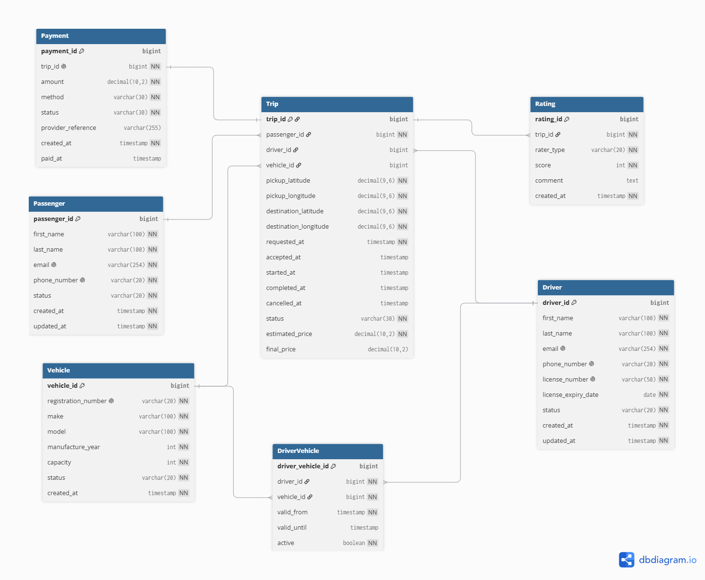
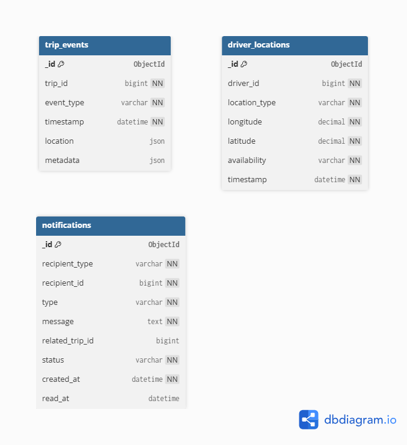

# 3. Database Models Specification

## 3.1 Data Distribution Overview
Ride-Hailing Platform makes use of the polyglot persistence approach in the implementation of its data storage layer which consists of PostgreSQL and MongoDB. Each of these DBMSs manages different data depending on its consistency needs and workload.
 
PostgreSQL handles the authoritative transactional state of the platform.
It handles structured business entities with complex relationships.

MongoDB manages selected operational data created by the platform as it executes its tasks. These can be created at high frequencies and can have variable structures depending on the operational events.

The initial distribution is the following:

| Data | Database | Model |
|---|---|---|
| Passenger | PostgreSQL | Relational |
| Driver | PostgreSQL | Relational |
| Vehicle | PostgreSQL | Relational |
| Driver–Vehicle association | PostgreSQL | Relational |
| Trip | PostgreSQL | Relational |
| Payment | PostgreSQL | Relational |
| Rating | PostgreSQL | Relational |
| Driver location | MongoDB | Document |
| Trip events | MongoDB | Document |
| Notifications | MongoDB | Document |

PostgreSQL is deemed as the source of truth in regards to the business status of a trip. Although MongoDB can make use of PostgreSQL objects using their IDs, the operational document does not take precedence over the relational business document.

## 3.2 PostgreSQL Relational Model

The following diagram presents the initial relational model for the transactional component of the Ride-Hailing Platform.



The diagram represents the main entities, identifiers, relationships and cardinalities of the PostgreSQL model.

### 3.2.1 Conceptual Model

We propose these seven relational entities:

Passenger
Driver
Vehicle
DriverVehicle
Trip
Payment
Rating

The conceptual relationships are:

```text
Passenger ───────────────< Trip >────────────── Driver
                             │                    │
                             │                    │
                             │                 DriverVehicle
                             │                    │
                             │                  Vehicle
                             │
                             ├──────── Payment
                             │
                             └────────< Rating

```


#### 3.2.1.1 Proposed ER relationships

```text
PASSENGER 1 ───────── N TRIP

DRIVER    1 ───────── N TRIP

DRIVER    1 ───────── N DRIVER_VEHICLE
                           N
                           │
                           1
                        VEHICLE

VEHICLE   1 ───────── N TRIP

TRIP      1 ─────── 0..1 PAYMENT

TRIP      1 ─────── 0..2 RATING
```


### 3.2.2 Passenger

The `Passenger` entity represents a customer who can request trips through the platform.

| Attribute | Description |
|---|---|
| passenger_id | Unique passenger identifier |
| first_name | Passenger's first name |
| last_name | Passenger's last name |
| email | Unique email address |
| phone_number | Unique contact number |
| status | Current account status |
| created_at | Account creation timestamp |
| updated_at | Timestamp of the last relevant account update |

`passenger_id` is the primary key.

Both `email` and `phone_number` must be unique.

The `status` attribute represents the operational state of the passenger account and will be restricted to values defined by the application, such as `ACTIVE`, `SUSPENDED` or `INACTIVE`.

### 3.2.3 Driver

The `Driver` entity represents a driver registered and authorized to perform trips through the platform.

Its main attributes are:

| Attribute | Description |
|---|---|
| driver_id | Unique driver identifier |
| first_name | Driver's first name |
| last_name | Driver's last name |
| email | Unique email address |
| phone_number | Unique contact number |
| license_number | Unique driving licence identifier |
| license_expiry_date | Expiration date of the driving licence |
| status | Driver account/authorization status |
| created_at | Creation timestamp |
| updated_at | Last update timestamp |

`driver_id` is the primary key.

The driver's licence number, email address and phone number must be unique.

### 3.2.4 Vehicle

The `Vehicle` entity stores information about vehicles authorized for use on the platform.

| Attribute | Description |
|---|---|
| vehicle_id | Unique vehicle identifier |
| registration_number | Unique vehicle registration number |
| make | Vehicle manufacturer |
| model | Vehicle model |
| manufacture_year | Year of manufacture |
| capacity | Maximum passenger capacity |
| status | Operational/authorization status |
| created_at | Registration timestamp |

The registration number must uniquely identify a vehicle.

The vehicle capacity must be greater than zero.

### 3.2.5 DriverVehicle

The relationship between drivers and vehicles is modelled through the `DriverVehicle` associative entity.

A driver may be authorized to use different vehicles over time, while a vehicle may also be associated with different drivers.

| Attribute | Description |
|---|---|
| driver_vehicle_id | Unique association identifier |
| driver_id | Driver reference |
| vehicle_id | Vehicle reference |
| valid_from | Beginning of the association |
| valid_until | End of the association, if applicable |
| active | Indicates whether the association is currently active |

`driver_id` is a foreign key referencing `Driver`.

`vehicle_id` is a foreign key referencing `Vehicle`.

### 3.2.6 Trip

`Trip` is the central transactional entity of the platform. It represents a transportation request from its creation until completion or cancellation.

| Attribute | Description |
|---|---|
| trip_id | Unique trip identifier |
| passenger_id | Passenger requesting the trip |
| driver_id | Assigned driver, if one has been assigned |
| vehicle_id | Vehicle used for the trip |
| pickup_latitude | Pickup latitude |
| pickup_longitude | Pickup longitude |
| destination_latitude | Destination latitude |
| destination_longitude | Destination longitude |
| requested_at | Time at which the trip was requested |
| accepted_at | Time at which a driver accepted the trip |
| started_at | Actual trip start |
| completed_at | Actual trip completion |
| cancelled_at | Cancellation timestamp |
| status | Current authoritative trip state |
| estimated_price | Price estimated when requesting the trip |
| final_price | Final amount after completion |

`trip_id` is the primary key.

`passenger_id` is a mandatory foreign key referencing `Passenger`.

`driver_id` and `vehicle_id` may initially be null because a trip exists before a driver accepts it. Once the trip reaches a state requiring an assigned driver, the application and database transaction logic must maintain a valid driver/vehicle assignment.

The initial set of allowed trip states is:

- `REQUESTED`
- `DRIVER_ASSIGNED`
- `DRIVER_ARRIVING`
- `IN_PROGRESS`
- `COMPLETED`
- `CANCELLED`

Only valid transitions between these states should be permitted.

### 3.2.7 Payment

The `Payment` entity represents the payment record associated with a trip.

| Attribute | Description |
|---|---|
| payment_id | Unique payment identifier |
| trip_id | Associated trip |
| amount | Amount to be paid |
| method | Payment method category |
| status | Current payment state |
| provider_reference | External/simulated payment reference |
| created_at | Payment creation timestamp |
| paid_at | Timestamp of successful payment |

Each payment belongs to exactly one trip.

For the initial prototype, each trip may have at most one payment record.
Therefore, `trip_id` must be unique in the `Payment` table.

Sensitive payment-card information will not be stored by the platform.

### 3.2.8 Rating

A `Rating` represents feedback submitted after a trip.

| Attribute | Description |
|---|---|
| rating_id | Unique rating identifier |
| trip_id | Trip being evaluated |
| rater_type | Indicates whether the author is the passenger or driver |
| score | Numerical rating |
| comment | Optional textual feedback |
| created_at | Rating creation timestamp |

A rating can only be associated with a completed trip.

The initial score range is from 1 to 5.

For each trip, a passenger may submit at most one driver rating and a driver may submit at most one passenger rating. This can be represented through a unique constraint over `(trip_id, rater_type)`.

### 3.2.9 Relationships

| Entity A | Cardinality | Entity B | Meaning |
|---|---:|---|---|
| Passenger | 1:N | Trip | Passenger may request multiple trips |
| Driver | 1:N | Trip | Driver may perform multiple trips |
| Vehicle | 1:N | Trip | Vehicle may be used in multiple trips |
| Driver | N:M | Vehicle | Implemented through DriverVehicle |
| Trip | 1:0..1 | Payment | Trip may have one payment |
| Trip | 1:0..2 | Rating | Passenger and driver may each rate the other |

These relationships are based on the life cycle of the service, rather than the current state of affairs. `DriverVehicle`, for instance, ensures that the relationship between drivers and vehicles is maintained, rather than holding just one permanent vehicle in `Driver`.

### 3.2.10 Integrity Constraints

**Entity integrity**

Every entity has a primary key.

**Referential integrity**

Trip.passenger_id → Passenger.passenger_id
Trip.driver_id → Driver.driver_id
Trip.vehicle_id → Vehicle.vehicle_id

DriverVehicle.driver_id → Driver.driver_id
DriverVehicle.vehicle_id → Vehicle.vehicle_id

Payment.trip_id → Trip.trip_id
Rating.trip_id → Trip.trip_id

**Uniqueness**

Passenger.email UNIQUE
Passenger.phone_number UNIQUE

Driver.email UNIQUE
Driver.phone_number UNIQUE
Driver.license_number UNIQUE

Vehicle.registration_number UNIQUE

Payment.trip_id UNIQUE

Rating(trip_id, rater_type) UNIQUE

**Domain constraints**

Vehicle.capacity > 0

Rating.score BETWEEN 1 AND 5

Trip.estimated_price >= 0
Trip.final_price >= 0

Payment.amount > 0

**Geographic constraints**

At minimum:
-90 <= latitude <= 90
-180 <= longitude <= 180

**Temporal constraints**

For a completed trip we expect logically:
requested_at
    <= accepted_at
    <= started_at
    <= completed_at

## 3.3 MongoDB Document Model

The following diagram provides a conceptual representation of the main MongoDB collections.



The diagram is intended to represent the structure of the MongoDB documents rather than a relational schema. References to PostgreSQL identifiers are logical application-level references and do not represent foreign-key constraints.

### 3.3.1 Driver Locations

The `driver_locations` collection stores operational observations of driver location and availability.

Example document:

```json
{
  "_id": "...",
  "driver_id": 82,
  "location": {
    "type": "Point",
    "coordinates": [-8.629105, 41.157944]
  },
  "availability": "AVAILABLE",
  "timestamp": "2026-10-01T18:32:10Z"
}
```

### 3.3.2 Trip Events

### 3.3.2 Trip Events

The `trip_events` collection represents operational events generated during the lifecycle of a trip.

Common fields include:

- `_id`;
- `trip_id`;
- `event_type`;
- `timestamp`;
- optional `location`;
- `metadata`.

The content of the `metadata` field may vary depending on the type of the event. It helps create new operational types of events without having the need for each event to have the same attributes.

The collection is not responsible for determining the authoritative state of the trip. It stays in the `Trip.status` field in PostgreSQL. However, the collection can help track the operation history of the trip.

### 3.3.3 Notifications

The `notifications` collection stores messages generated by the platform for passengers and drivers.

A notification contains:

- a recipient;
- notification type;
- message;
- optional related trip;
- notification status;
- creation timestamp;
- optional read timestamp.

The recipient is represented through its type and corresponding PostgreSQL identifier.

### 3.3.4 Document Relationships and References

Documents within the MongoDB database can hold identifiers of entities that exist in the PostgreSQL database. These references are logical application-level references and not foreign-key references.

For instance:

`driver_locations.driver_id`

refers to:

`PostgreSQL.Driver.driver_id`

as well as:

`trip_events.trip_id`

refers to:

`PostgreSQL.Trip.trip_id`.

Thus, the referential integrity cannot be maintained directly between the two DBMSs. The application must make sure that the documents created within MongoDB are valid for entities in PostgreSQL.

This compromise is made since MongoDB is an operational database, whereas PostgreSQL serves as the source-of-truth for business entities.

### 3.3.5 Document Validation and Constraints
For driver_locations:
driver_id      required
location       required
timestamp      required

location.type = "Point"

availability ∈
AVAILABLE
BUSY
OFFLINE

For trip_events:
trip_id       required
event_type    required
timestamp     required

For notifications:
recipient     required
type          required
message       required
status        required
created_at    required

Whereas MongoDB offers a highly flexible document model, in the current project, however, collection validation criteria will be put in place for those fields which would be mandatory in order to interpret the operational data correctly.

Primarily, flexibility will be offered only to fields like `metadata` relating to the event.

## 3.4 Cross-Database Data Ownership

| Data | PostgreSQL | MongoDB | Authority |
|---|:---:|:---:|---|
| Passenger profile | ✓ | | PostgreSQL |
| Driver profile | ✓ | | PostgreSQL |
| Vehicle | ✓ | | PostgreSQL |
| Driver/vehicle authorization | ✓ | | PostgreSQL |
| Trip | ✓ | | PostgreSQL |
| Current authoritative trip status | ✓ | | PostgreSQL |
| Payment | ✓ | | PostgreSQL |
| Rating | ✓ | | PostgreSQL |
| Driver location observations | | ✓ | MongoDB |
| Driver operational availability | | ✓ | MongoDB |
| Trip event history | | ✓ | MongoDB |
| Notifications | | ✓ | MongoDB |
| Authentication | Django/PostgreSQL | | Django/PostgreSQL |

There is only one database for every type of information.

It was purposely decided not to create two independent authoritative copies of the same business object in both databases. In case MongoDB documents have to refer to a PostgreSQL entity for operational information, then the duplicate copy of the entity will not be created.

It helps to avoid synchronization issues and makes the responsibility of every database clear.

**Driver availability**
In Section 1 we said driver availability could be operational data.
So:
Driver.status

and:
driver_locations.availability

are not the same thing.

A difference is made between `Driver.status` and driver operational availability.

The `Driver.status` property in PostgreSQL shows whether the driver is authorized to perform operations within the application. Some examples of possible values include `ACTIVE`, `SUSPENDED` or `INACTIVE`.

Driver operational availability is an indication of whether the driver is available to handle trip requests. This information is maintained along with operational driver information in MongoDB.

**Coordinates in Trip vs MongoDB**

If locations are MongoDB, why does Trip contain pickup/destination coordinates in PostgreSQL?

Pickup and destination coordinates contained within `Trip` are part of the business representation of the requested service and should stay tied to the official trip record.

On the other hand, records in `driver_locations` are operational observations that keep changing over time.

This means that storing origin/destination locations of the trips in PostgreSQL is not duplicating the purpose of the operational locations collection.

## 3.5 Database Model Summary
Initially defined database model splits the transactional and operational tasks of the Ride-Hailing Platform.

PostgreSQL stores the structured model of the business represented by Passenger, Driver, Vehicle, DriverVehicle, Trip, Payment and Rating entities. Relational model defines explicit identifiers, relationships and integrity constraints for the authoritative state of the platform.

MongoDB stores the operational collections `driver_locations`, `trip_events` and `notifications`. Collections are created for data whose access, writing frequency or document schema is different from the transactional core.

References between the databases are created using stable identifiers.
PostgreSQL is still authoritative for the existence and business state of passengers, drivers, vehicles and trips, MongoDB stores the operational information related to the entities.

Proposed models are only initial specifications that can be further optimized when implementing the solution in the second iteration of the project.