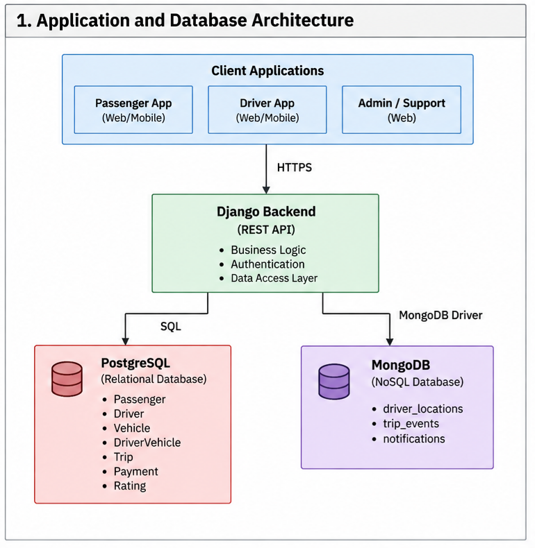
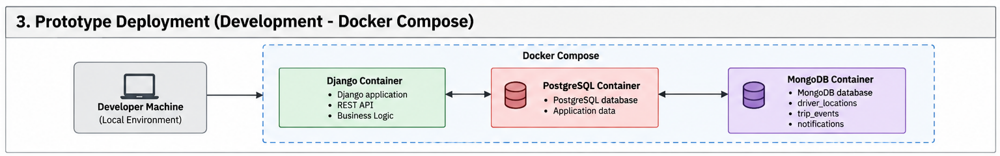

# 4. Deployment and Architecture Analysis

## 4.1 Architecture Overview
The suggested Ride-Hailing Platform is designed based on the multi-tier architecture where the client applications are connected to the backend implemented in Django to perform the business logic and connect to the persistence layer.

The persistence layer is designed based on the polyglot persistence approach described in the previous sections, and consists of the following two database technologies:

- PostgreSQL, used to store transactional and business data;
- MongoDB, used to store selected operational data, such as driver location information, events and notifications related to trips.

The application layer is the only component that directly works with both databases.
Client applications do not have direct connections to the databases.

The following two deployment scenarios are discussed within this section:

1. The **prototype deployment**, intended for the development, testing and academic validation;
2. The **target deployment**, reflecting the architecture that is more suitable for the Ride-Hailing Platform.

## 4.2 Initial Application and Database Architecture
The figure below illustrates the application and database components of the platform.

Client applications interact only with the backend application, Django.
Databases are thus not directly accessible to any passenger, driver or administrative client applications.

Django is in charge of enforcing the business logic discussed above and accessing the databases, PostgreSQL and MongoDB.

## 4.3 Prototype Deployment
The proposed prototype deployment is illustrated below.

For the purpose of development and academic validation, it is intended that the prototype will operate in a local environment.

Both application and database layers can be containerized using Docker Compose, into:

- one Django application layer service;
- one PostgreSQL database layer service;
- one MongoDB database layer service.

This way it will provide reproducible development environment that is still simple enough for implementation, testing and demonstration.

It is not the intention of the local prototype to mimic the availability and scalability features of the suggested architecture of the production environment. It should rather provide an environment for implementation and evaluation of database models, queries, indexes, backups, recovery and workload behavior.

## 4.4 Deployment Alternatives

| Criterion | On-Premises | Cloud |
|---|---|---|
| Infrastructure ownership | Organization | Cloud provider |
| Hardware control | High | Lower/abstracted |
| Initial provisioning | Requires infrastructure preparation | Resources can be provisioned on demand |
| Capacity expansion | Organization-managed | Easier resource expansion |
| Maintenance | Organization | Partially/provider managed |
| Database patching | Organization | Can be provider managed |
| Backup | Organization responsible | Managed services can assist/automate |
| High availability | Must be designed/operated internally | Managed HA options commonly available |
| Scalability | Depends on available infrastructure | Resources can generally be scaled more dynamically |
| Cost model | Infrastructure acquisition/operation | Consumption/subscription based |
| Data locality/control | High | Depends on provider/configuration |
| Operational complexity | Higher internal responsibility | Some responsibilities transferred to provider |

None of the two deployment strategies is better than the other.
The right decision will depend on the workload, as well as on some technical and organizational needs like cost, security, performance and availability.

Cloud deployment does not mean less security or higher costs, whereas on-premises deployment does not necessarily mean more security or performance. This is the reason why this decision should be taken in regard to the particular Ride-Hailing Platform.

### 4.4.1 On-Premises Deployment
The on-premise implementation will enable the organization to gain full control over the database server, network settings, OS and DB configurations.

Such a strategy may prove beneficial when full control over the infrastructure, data locality or compatibility with the organizational systems is needed.

Consequently, the On-Premises Deployment for the Ride-Hailing Platform could offer:

- full control over PostgreSQL and MongoDB infrastructure;
- full control over network and security settings;
- organization-based data locality;
- significant infrastructure customization capabilities;
- independence from any cloud service provider.

Nevertheless, the organization will have to ensure the appropriate infrastructure and enough capacity to guarantee the database availability, replication, monitoring, backups and recoveries.

### 4.4.2 Cloud Deployment
The cloud deployment will transfer the part of the responsibility of managing the infrastructure to the cloud provider and enable the provision of computing and database resources based on demand.

This approach would be quite beneficial for the Ride-Hailing Platform as its workload will not necessarily remain stable. The number of active drivers and location updates/trip requests might change significantly over time.

The cloud deployment may help with the following:

- application instance deployment;
- managed database services;
- scaling of resources;
- monitoring;
- backup system;
- replication and high availability setup;
- infrastructure growth without having to buy new physical servers.

Such benefits will not reduce the responsibility of the team for designing the database, configuring the security settings, setting the backup policy, monitoring and analysis of performance.

## 4.5 Selected Deployment Approach
For the purpose of production deployment of the Ride-Hailing Platform, the team suggests an architecture based on cloud resources.

The main motivation for choosing such an approach comes from the variability of the load for the platform which can be unevenly distributed.
It means that a Ride-Hailing Platform can face fluctuations in the number of passengers, drivers, requests, location updates depending on time of day and demand.

Thus, the required architecture should provide flexibility in expanding the application and database capacity without a need for the organization to invest in all the hardware resources upfront.

The cloud environment provides adequate tools for deployment of redundant services, database replication, monitoring and backup services that are appropriate for the application where a brief period of downtime will not allow to receive and send requests.

This does not mean that having an on-premises architecture would be necessarily technically invalid. There is a possibility that an entity that needs infrastructure control or data locality may choose an on-premises or hybrid architecture.

But taking into consideration the present requirements for this project, the cloud architecture appears to be a good starting point for future growth.

## 4.6 Availability and Infrastructure Requirements

### 4.6.1 Application Layer
A Ride-Hailing Platform Production should not rely on a single instance of its application.

Consequently, the design will include consideration for a number of Django application instances that run behind the load balancer or reverse proxy.
Requests could be routed among the running application instances so that failure of any single instance does not affect it.

As much as possible, the application instances should be stateless such that requests can be processed by different application instances without necessitating client affinity to a particular application server.

### 4.6.2 PostgreSQL Availability and Replication
PostgreSQL contains the definitive transactional state of the system.
Its availability is thus essential for operations like creating a trip, assigning the driver, completing the trip, and registering payment.

Thus, the required architecture should ensure that there is no single PostgreSQL server holding the definitive transactional state.

For this, a primary-replica architecture is thus recommended, where the primary database is responsible for the definitive transactional load and the replicas hold copies of the database.

Replication could be useful in ensuring the availability of the system and can also be used for certain read transactions. However, the replication is not a substitute for backup because the replication of errors or undesired database updates could also be done.

The precise replication and failover strategy will be decided on implementation.

### 4.6.3 MongoDB Availability and Replication
Operational information such as driver location tracking, event and notification tracking would be stored in the MongoDB database.

In case of a production environment, the MongoDB database architecture would require replication in order to decrease the dependency on a single database.

Replication will be used in the target deployment as a result of that. The presence of several copies of operational data will allow fault tolerance and recovery from the failure of a particular node.

A single instance of the MongoDB would be enough for a prototype due to its limited purposes.

### 4.6.4 Data Distribution
The prototype does not necessarily need the database to be distributed in multiple geographic sites.

Nevertheless, the desired target system must support database distribution if there is a need to distribute due to scaling to handle much bigger workloads or more geographic regions.

PostgreSQL first requires handling of transaction consistency and replication and not necessarily data partitioning on different database nodes.

If the number of location observations and trip events is very high, it could be a concern for MongoDB and thus the sharding becomes an important consideration.

Sharding, thus, becomes a scalability issue in the future and not for the initial prototype.

### 4.6.5 Network and Security Requirements
Database systems should never be accessible to external public client applications.

Connections to PostgreSQL and MongoDB at an application level must be only made by the Django application layer.

The following security requirements should therefore be implemented in the target infrastructure:

- any communication between the client and the application must be done via encrypted HTTPS connections;
- PostgreSQL and MongoDB must accept connections only from authorized application or administrative modules;
- no credentials should be present in plain text within the source code;
- no secrets and environment configuration data should be committed to the Git repository;
- limited administrative access to databases;
- principle of least privilege should be followed when creating both application and administrative database accounts;
- encrypted communication channels should be used for database connections, where applicable.

### 4.6.6 Infrastructure Summary
The prototype is deliberately based on a less complicated infrastructure than the intended architecture. The difference ensures that the team can implement and test the necessary database administration principles without the need for a production-level cloud-based environment.

The architecture does retain an upgrade route from the prototype to a more robust system by means of application replication, database replication, monitoring, backup infrastructure, and database distribution where appropriate.

| Component | Prototype | Target architecture |
|---|---|---|
| Django | Single local/container instance | Multiple instances |
| PostgreSQL | Single instance | Primary + replica(s) |
| MongoDB | Single instance | Replica set |
| Load balancing | Not required | Required |
| Deployment | Local/Docker | Cloud |
| Database network | Local/private Docker network | Private network |
| Public DB access | No | No |
| TLS/HTTPS | Development-dependent | Required |
| Monitoring | Basic | Centralized |
| Backup | Implemented/tested | Automated + external storage |
| Horizontal DB distribution | Not initially | Consider according to workload |
| Geographic distribution | No | Future requirement if service expands |

## 4.7 Architecture Analysis Summary
Ride-Hailing Platform will be initially developed as a local prototyping project using Django, PostgreSQL, and MongoDB technologies, while containerization will be considered in order to ensure reproducibility and separation of components.

For a production-like project, cloud-based deployment is proposed by the team. The reason behind this decision is associated mostly with the dynamic workload of the system and the need for scalability, availability, monitoring, and database replication capabilities.

PostgreSQL will be used to store the authoritative transactional data, while MongoDB is going to contain some operational workloads. Both databases will be separated from the public clients and will be accessible only via Django layer.

The architecture considers a multiple number of application instances, PostgreSQL replication, MongoDB replica set, backup and
monitoring services. However, horizontal data distribution will not be used in the initial prototype of the application but can be added based on workload measurement results.

Therefore, this architecture can be considered as an initial plan for deployment that can be improved during the implementation process and tested against the real workloads of Iteration 2.