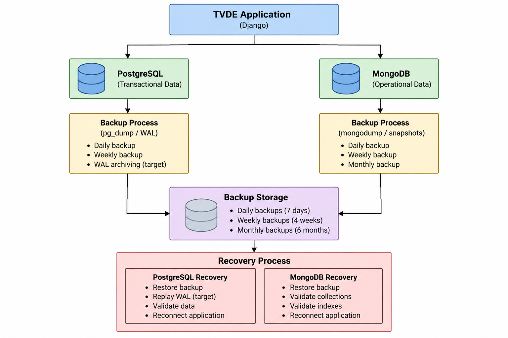

# 5. Backup Policy Specification

## 5.1 Backup Objectives
Data in the Ride-Hailing Platform are stored with varying levels of business criticality and recovery needs.

PostgreSQL holds the definitive transactional state of the platform, including passengers, drivers, vehicles, trips, payments and ratings. 
Corruption of this data would have a direct impact on the business state of the platform.

MongoDB, on the other hand, holds operational information like locations of drivers, trip events and notifications. While these data are important for the operation of the platform, monitoring and incident analysis, their needs for recovery are different from those of the transactional database.

In this context, the backup policy defines separate backup and recovery processes for PostgreSQL and MongoDB based on the nature and criticality of the data stored in these DBMSs.

Objectives of the policy include:

- protection of the platform from accidental data loss or corruption;
- provision of recovery after database or infrastructure failures;
- maintenance of multiple recovery points;
- making sure an infrastructure failure does not destroy production and backup copies of data;
- setting recovery objectives which can be measured;
- periodic verification of restoration capabilities.

The overall backup and recovery strategy is represented below.



## 5.2 Data Criticality
The backup strategy is based on the role assigned to each database in the data model.

| Data | DBMS | Criticality | Recovery Priority |
|---|---|---|---|
| Passengers | PostgreSQL | High | High |
| Drivers | PostgreSQL | High | High |
| Vehicles | PostgreSQL | High | High |
| Trips | PostgreSQL | Critical | Critical |
| Payments | PostgreSQL | Critical | Critical |
| Ratings | PostgreSQL | Medium | Medium |
| Driver location observations | MongoDB | Medium | Lower |
| Trip events | MongoDB | High | High |
| Notifications | MongoDB | Medium | Medium |

Priority to recover PostgreSQL is the highest as it holds the authoritative state of the business of the application.

MongoDB data is also significant; however, the trip event history is more crucial than the recent location observations that can be lost without major consequences.

## 5.3 PostgreSQL Backup Strategy

### 5.3.1 Prototype Strategy
PostgreSQL backups, done logically with `pg_dump`, will be used for the prototype.

Logical backups are well suited for our prototype as they are easily created, stored, viewed, and restored in an isolated development environment.

The proposed command for backup is the PostgreSQL custom archive format:

```bash
pg_dump -Fc -d tvde -f tvde_backup.dump
```
### 5.3.2 Target Production Strategy
The production deployment will require a stricter recovery goal compared to the prototype.

Pure periodic logical backups could cause the loss of all transactions executed since the last backup operation. The situation is critical for trips and payments.

Consequently, the proposed PostgreSQL approach includes periodic backups as well as continuous archiving of the PostgreSQL Write-Ahead Log (WAL).

By using WAL archiving, it becomes possible to use the Point-in-Time Recovery (PITR), which allows you to recover the database to a selected point between the full/base backups.

The recovery concept includes the following steps:

1. restoration of the corresponding PostgreSQL base backup;
2. fetching of the WAL records created after the base backup;
3. replaying the WAL till the required recovery point.

The approach is expected to minimize the risk of losing transactional data compared to the only usage of the periodic logical dumps.

PostgreSQL replication is not seen as a substitute for backup.

A replica provides increased availability in case of failures of some infrastructure nodes, but accidental data deletion, incorrect changes, or application-level corruption can also affect the replica.

Therefore, the system architecture views replication and backup as two complementary approaches: replication is meant to provide increased availability, and backup (PITR) is meant to provide data recovery.

### 5.3.3 PostgreSQL Retention
The initial target retention policy for PostgreSQL is:

| Backup | Frequency | Retention |
|---|---|---|
| Daily | Once per day | 7 days |
| Weekly | Once per week | 4 weeks |
| Monthly | Once per month | 6 months |

WALs archived as per the specified recovery window are to be stored in a manner consistent with the relevant base backup.

Retention periods can be modified based on storage consumption analysis and business/ regulatory needs.

## 5.4 MongoDB Backup Strategy

### 5.4.1 Prototype Strategy
For the prototype design, `mongodump` will be used for taking logical backups of the MongoDB database.

Backup would contain the following operational collections from the data model:

- `driver_locations`;
- `trip_events`;
- `notifications`.

An example backup operation would be:

```bash
mongodump --db tvde_operations --out ./backup/
```
### 5.4.2 Target Production Strategy
Regarding the targeted deployment on the cloud, the MongoDB backups should be performed using the snapshot or continuous backups provided by the chosen production environment.

The plan has to allow recovery through historical backups that are independent of the MongoDB replica set.

In the case of PostgreSQL, replication is not a backup. Replication of MongoDB allows for redundancy and availability; however, any logical errors and unintended modifications to the data may propagate to replica set members.

Historical backups should thus be stored separately from the MongoDB replica set.

### 5.4.3 MongoDB Retention
The initial MongoDB retention policy is:

| Backup | Frequency | Retention |
|---|---|---|
| Daily | Once per day | 7 days |
| Weekly | Once per week | 4 weeks |
| Monthly | Once per month | 6 months |

There may be the need for a particular data retention policy for the operational data collected, especially concerning large volumes of driver locations.

It is important to review the retention period after determining the rate of increase of the data in iteration 2.

## 5.5 Backup Storage and Security
The backups should never reside only on the same storage device or instance as the database.

In the case of the local prototype, the backup files will be first created in the development environment, but when used for recovery testing, they will need to be kept separate from the database containers and their persistent volumes.

For the production deployment, the backups should be stored in a separate backup or object storage.

The storage for the backups should have the following features:

- restricted access;
- encryption support if applicable;
- integrity;
- enough storage space for the retention period set;
- monitoring of failed backup actions;
- anti-deletion measures if possible.

The credentials for the databases should never be hard-coded into the backup scripts residing in the Git repo.

Backup and recovery scripts will be versioned in the project repository, but generated backup archives will not be committed to Git.

## 5.6 Backup Schedule and Retention Policy
| Database | Mechanism | Frequency | Retention | Purpose |
|---|---|---|---|---|
| PostgreSQL | Logical `pg_dump` | Daily | 7 days | Short-term recovery |
| PostgreSQL | Logical/base backup | Weekly | 4 weeks | Medium-term recovery |
| PostgreSQL | Backup | Monthly | 6 months | Historical recovery |
| PostgreSQL | WAL archive | Continuous (target) | According to PITR window | Point-in-time recovery |
| MongoDB | `mongodump` / snapshot | Daily | 7 days | Short-term recovery |
| MongoDB | Snapshot/backup | Weekly | 4 weeks | Medium-term recovery |
| MongoDB | Snapshot/backup | Monthly | 6 months | Historical recovery |

Exact time for backup execution must try to stay away from high activity periods within the database if possible.

It is very important to keep track of the results of backups. The successful execution of the scheduled backup cannot be based on only starting the process; its result must also be verified.

## 5.7 Recovery Strategy

### 5.7.1 PostgreSQL Recovery
The recovery process on a PostgreSQL database would normally involve:

1. determining the type and timing of the crash;
2. stopping any further writing if necessary;
3. determining the most suitable backup;
4. preparing a clean instance of PostgreSQL;
5. restoring the chosen backup;
6. if it is the production approach, applying the archived
   WALs up to the correct recovery point;
7. checking the integrity of the database and critical files;
8. connecting the application only after checking;
9. watching for anomalies in the restored system.

Recovery testing of the prototype system will involve mostly `pg_restore` on a stand-alone PostgreSQL database.

### 5.7.2 MongoDB Recovery
Recovery of the MongoDB database shall proceed through the following steps:

1. identify which collections need recovery and when;
2. identify a proper MongoDB backup or snapshot;
3. create an isolated MongoDB database instance where applicable;
4. recover the data using mongorestore or the recovery facilities available in the target environment;
5. validate by counting documents, verifying some sample data and indexes;
6. validate logical relationships to PostgreSQL entities where applicable;
7. reconnect the application after validation is completed.

The prototype implementation shall be recovered via `mongorestore`.

### 5.7.3 Complete Platform Recovery
In the event that both databases are required to be recovered, then PostgreSQL should always be recovered and validated prior to MongoDB, because PostgreSQL stores the authoritative business entities that are used by MongoDB documents.

The recovery process should therefore involve the following steps:

1. provisioning the infrastructure; 
2. recovery of PostgreSQL; 
3. validation of the core business entities and transactional consistency; 
4. recovery of MongoDB; 
5. validation of operational data and cross-database references; 
6. start or re-establish connection for the Django application; 
7. perform application-level validation tests; 
8. establish client connectivity.

The specific sequence will depend on the incident scenario.

## 5.8 Recovery Objectives

### 5.8.1 Recovery Point Objective (RPO)
Recovery Point Objective specifies the maximum time period of data loss after a system failure.

The proposed target objectives are:

| Database | Target RPO |
|---|---:|
| PostgreSQL | 15 minutes |
| MongoDB | 1 hour |

PostgreSQL gets the more stringent RPO since it holds the true state of trips and payments.

PostgreSQL RPO assumes an enterprise backup strategy that supports point in time recovery.
Simpler prototype backup strategy does not satisfy this requirement at first.

MongoDB is assigned less strict RPO since some portion of its workloads such as location observation is less critical to the business.

### 5.8.2 Recovery Time Objective (RTO)
The Recovery Time Objective determines the time target for restoration of the affected database service after an incident.

The proposed targets are:

| Database | Target RTO |
|---|---:|
| PostgreSQL | 1 hour |
| MongoDB | 2 hours |

The restoration of PostgreSQL is prioritized higher since the application is not able to complete its main functions without data from the authoritative business source.

These values represent goals at the initial design stage. In the next iteration (Iteration 2), it will be necessary to test how much time it takes to restore the prototype.

## 5.9 Backup Validation and Recovery Testing
Backup creation alone does not prove the ability to recover the system, and for this reason, the project will include recovery testing in Iteration 2.

The planned validation will cover the following aspects:

- verification of successful generation of scheduled backup files;
- verification of backup file size and expected metadata;
- restoration of PostgreSQL in an isolated test database;
- restoration of MongoDB in an isolated test database;
- verification of representative records after restoration;
- verification of PostgreSQL constraints and relationships;
- verification of MongoDB collections and indexes;
- execution of selected queries of the application after recovery;
- timing of the restore process;
- documenting the recovery test results.

Recovery testing must be carried out in a way that avoids overwriting the active development database whenever possible.

## 5.10 Backup Policy Summary

This difference is represented in the backup policy for PostgreSQL and MongoDB.

PostgreSQL gets the highest recovery requirements because it contains the master transactional state of the Ride-Hailing Platform. The prototype will use `pg_dump` and `pg_restore`, while in target production there will be taken into account also WAL archiving and Point-in-Time Recovery.

The MongoDB backups will be started with `mongodump` and `mongorestore`.
In the target architecture, separate snapshots or continuous backups may be used without connection to the MongoDB replica set.

Both databases have the multilayered approach to backups including daily, weekly and monthly recovery points. Copies of backup data should be kept separate from live database environment and the access to backup data should be limited.

Initial target recovery goals include RPO equal to 15 minutes and RTO equal to 1 hour for PostgreSQL and RPO equal to 1 hour and RTO equal to 2 hours for MongoDB.

These are only design targets and not guarantees yet. During Iteration 2, recovery tests will be conducted to measure actual recovery properties of the prototype.