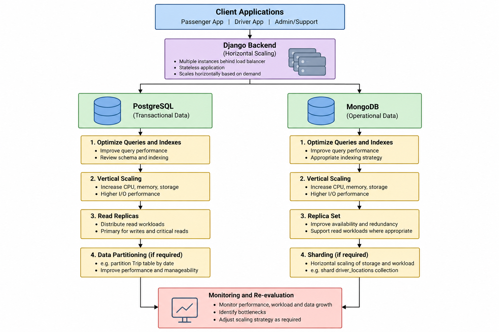

# 6. Scalability and Elasticity Plan

## 6.1 Scalability Objectives
The Ride-Hailing Platform will be expected to handle a load that will vary greatly depending on the number of active passengers, drivers and trips at any moment of time.

Unlike systems dealing with stable workloads, there could be times when a ride-hailing platform would need to handle a peak of activity when many passengers are asking for rides, and simultaneously many drivers keep on updating their location and status.

Thus, the scalability approach should take into account both the amount of data stored, and the amount of reads/writes.

Main goals are:

- the possibility to serve more and more passengers, drivers and trips;
- handling the periods of high activity of requests;
- handling the constant updates of drivers' locations;
- keeping good performance in case of growing amount of historical data;
- not spending resources to expand the infrastructure at times of low load;
- preserving the necessary transactional consistency of the business data;
- allowing the evolution of the architecture according to the actual load, not complicating things unnecessarily at the beginning.

PostgreSQL and MongoDB will have different roles in the architecture and thus different approaches to scalability.

The conceptual scalability strategy for the platform is illustrated below.

## 6.2 Anticipated Workload and Data Growth
This platform will create a combination of transaction and operational load.

The load will not be evenly distributed among PostgreSQL and MongoDB as the roles of the two databases are different.

The authoritative business transactions will be done by PostgreSQL, whereas operational information will be done by MongoDB with a substantially higher frequency.

Below is a summary of the anticipated load characteristics.

| Operation | DBMS | Type | Expected Relative Frequency |
|---|---|---|---|
| Passenger/driver authentication and profile access | PostgreSQL | Read | High |
| Trip creation | PostgreSQL | Write | High |
| Driver assignment | PostgreSQL | Read/Write | High / Critical |
| Trip status changes | PostgreSQL | Write | High |
| Payment registration | PostgreSQL | Write | Medium / Critical |
| Trip history | PostgreSQL | Read | High |
| Driver location updates | MongoDB | Write | Very High |
| Nearby/available driver lookup | MongoDB | Read | Very High |
| Trip event creation | MongoDB | Write | Very High |
| Notification creation | MongoDB | Write | High |
| Notification retrieval | MongoDB | Read | High |

### 6.2.1 Read Workload
PostgreSQL read activities will involve retrieving profile details, trip history, vehicle and driver information, administrative reporting, and accessing completed trips data.

Most of these read operations might be increasingly costly based on the increase in the number of trips especially historical reporting and administrative reporting.

MongoDB will have frequent operational reads especially where the application is required to retrieve recent driver availability and locations.

This requires that the scale out strategy considers indexing, query optimization and read activity distribution among database replicas if necessary.

### 6.2.2 Write Workload
Write operations have certain features in each of the database systems.

Writes related to the operations in the business are received by the PostgreSQL database. For instance, these include the creation of trips, assignment of drivers, changes in trip states, payments and ratings.

Even if there is a frequency of these operations, they should be carried out with consistency as contradictory and duplicate update can lead to the invalid business state.

Writes related to the operations in the application are received by the MongoDB database. An example can be driver location updates, as they can be made several times while working on the platform.

Trip events and notifications can also provide constant operational data.

Therefore, MongoDB is expected to receive a higher number of writes.

### 6.2.3 Data Growth
Furthermore, the two databases show a difference in data growth trends.

Growth in the PostgreSQL database is mainly dependent on:

- the number of registered users;
- the number of registered cars;
- the number of trips;
- the number of payments;
- ratings.

Growth in the MongoDB database is mainly dependent on:

- location of the driver;
- events of a trip;
- notifications.

The `driver_locations` collection has become the biggest potential source of data growth, since more than one location of the same driver can be captured during one trip or availability time.

Trip and payment data in the PostgreSQL database are rare but more business-relevant compared to others.

Thus, growth in data is going to be tracked separately for each database and collection/table.

## 6.3 Application-Layer Scalability
The database scalability approach is complemented by the application architecture provided in Section 4.

The intended deployment allows several instances of the Django application to work under a load balancer or reverse proxy.

As far as possible, the application instances should be kept stateless so that requests can be balanced across instances without
relying on a particular application server.

This would allow the application layer to scale out independent of the database layer.

However, the addition of application instances might lead to more database connections. This would mean that the usage of database
connections needs to be watched to avoid unnecessary strain on PostgreSQL/MongoDB due to application scaling.

## 6.4 PostgreSQL Scalability Strategy
The authoritative transactional status of the system is recorded by PostgreSQL.
Thus, the scaling process is focused on transactional consistency and controlled scaling instead of distribution of write requests right away.

### 6.4.1 Vertical Scaling

Firstly, the scaling solution for PostgreSQL is vertical scaling.

When it turns out that resources are saturated from the workload point of view, the database can be provided with extra resources in form of:

- CPU;
- memory;
- storage space;
- storage I/O speed.

Vertical scaling ensures that database architecture will remain relatively simple without introducing data distribution.

Prior to upgrading resources, performance of the database needs to be assessed using query optimization and indexing.

Nevertheless, vertical scaling has limitations. Notwithstanding the fact that the database can always be scaled up, this approach has limits.

### 6.4.2 Read Scaling and Replication
The proposed architecture already takes into account PostgreSQL replication of primary/replica nature for availability purposes.

In cases where the application allows, read replicas could be used for distributing some read workloads.

The architecture concept is then as follows:

- PostgreSQL primary: writes and transactions requiring consistency;
- PostgreSQL replica: selected read transactions where replication lag is acceptable.

Some of the candidates for read replicas could be reporting or historic queries that do not require up-to-date transactional state.

Queries like driver allocation, payments or trip state check, however, need to stay at the authoritative transactional database.

Read replicas would reduce the read load from the primary, but at the same time, it creates additional complexity, including possible lag of replicas.

### 6.4.3 Data Partitioning
In case the individual tables within PostgreSQL get larger, table partitioning might be taken into consideration before implementing database sharding at an application level.

The `Trip` table may be a possible candidate for future partitioning due to accumulation of trips records constantly and the natural association of most historical queries with time periods.

For instance, a possible range partitioning might be based on trip dates.

However, partitioning may make the management of the data easier and may positively affect some queries and maintenance operations depending on the partitioning strategy.

Nevertheless, partitioning adds complexity both to schema and operations and should be only applied after measuring the gain from such an approach.

### 6.4.4 PostgreSQL Scaling Approach
In fact, the first PostgreSQL approach does not provide for horizontal scaling of transactional write operations across multiple database nodes.

It would make transaction coordination and consistency management more complicated and complicate application logic as well.

The scaling sequence should be the following:

1. optimize queries, indexes and schema;
2. scale vertically the PostgreSQL instance when required;
3. utilize replicas for proper read load;
4. assess table partitioning at higher volumes of data;
5. assess more sophisticated horizontal scaling when the previous methods appear to be insufficient.

This careful sequence is determined by the fact that PostgreSQL acts as the authoritative transactional database of the platform.

## 6.5 MongoDB Scalability Strategy
MongoDB deals with operational loads that have write rates and data growth that might be much greater than those of transactional load.

This way, the scaling approach needs to include both vertical and horizontal options.

### 6.5.1 Vertical Scaling

Similar to PostgreSQL, the MongoDB setup could first be scaled vertically through increased CPU power, memory, storage capacity, or performance.

Proper indexes and queries would need to be identified beforehand, too.

Vertical scaling is a straightforward option for prototyping and small loads, but it will ultimately become constrained by the resources of a single node.

### 6.5.2 Replica Sets
In the targeted system design, there will be a MongoDB replica set in place to not depend on just one database server.

Replication mainly enhances availability and redundancy.

In cases depending on consistency needs and application setup, certain read queries could be fulfilled by replica-set nodes.

But replication does not share the entire dataset across nodes; instead, each replica holds a copy of the replicated data.

Hence, replication does not address the problem of unbounded storage needs or write scalability.

As explained in Section 5, neither should replication be taken to be an alternative to backup.

### 6.5.3 Horizontal Scaling through Sharding
Should the operational collections of MongoDB exceed the capacity and/or throughput that a single replica set is able to efficiently serve, then sharding may be implemented.

Because sharding splits the documents into several shards, this gives the means to horizontally scale both the storage and the workload.

The `driver_locations` collection is most likely to be sharded in the future due to the high amount of writes expected from many active drivers.

Another possible option to be sharded is `trip_events` collection, should the amount of events increase significantly.

A good choice of a shard key is an important aspect in the design.
A bad shard key may lead to unbalanced data and/or workload distribution and make horizontal scaling less effective.

For this reason, the project does not specify the exact shard key until the representative workload measurements are performed.

Properties that could be considered in a future implementation include driver ids, trip ids, timestamps or some compound keys depending on the queries used predominantly.

Sharding may thus be treated as a target scalability solution but not a requirement for the initial prototype.

### 6.5.4 MongoDB Scaling Approach
The MongoDB scaling strategy that I would recommend would be:

1. optimizing documents, queries, and indexes;
2. scaling up the MongoDB platform vertically where applicable;
3. creating a replica set for reliability and backup purposes;
4. using proper retention strategies for operational data;
5. monitoring collection size, write rate, and query performance; and
6. implementing sharding when the workload becomes too large for a single replica set.

This way you do not make your database unnecessarily complicated until it is required by the workload.

## 6.6 Elasticity in the Target Architecture
Scalability and elasticity are similar and yet different concepts.

Scalability means the ability of the system to deal with growing workload by expanding resources.

Elasticity means the ability to adapt those resources according to demand changes.

Cloud-oriented target architecture, discussed in section 4, is expected to demonstrate higher level of elasticity compared to the local prototype.

Django application layer seems to be the most obvious choice for horizontal scalability, as new application instances could be added or removed depending on the demand.

More attention needs to be paid to the question of database elasticity, since databases store stateful data and any changes in database topology could have implications for replication, consistency and performance.

In the case of PostgreSQL resource scaling is likely to be less radical, and vertical scaling and read replicas would be used depending on demand.

As for MongoDB, the new capacity might be acquired using replica-set resources or shards eventually.

Therefore, the project does not assume automatic or uniform resource scaling of all components.

## 6.7 Technical Considerations and Trade-offs

| Strategy | Advantages | Trade-offs |
|---|---|---|
| Query/index optimization | Can improve performance without additional infrastructure | Requires workload analysis; excessive indexes increase write/storage cost |
| Vertical DB scaling | Simple architecture; no data distribution | Finite capacity; larger instances may cost more |
| PostgreSQL read replicas | Reduces selected read load on primary; improves redundancy | Replication lag; additional infrastructure; not appropriate for all consistency-sensitive reads |
| PostgreSQL partitioning | Improves manageability of large tables; may benefit suitable queries | More complex schema/maintenance; benefit depends on workload |
| MongoDB replica set | Availability and redundancy | Replicates rather than divides dataset; does not by itself solve storage/write scaling |
| MongoDB sharding | Horizontal storage and workload distribution | Greater operational complexity; shard-key choice is critical |
| Django horizontal scaling | Application capacity can follow demand | More DB connections and infrastructure coordination |
| Cloud elasticity | Resources can be adjusted to workload | Cost can vary; requires monitoring and scaling policies |

Any scaling solution is useless without taking into account its impact on other parts of the system.

For instance, the use of indexing might make reading faster, however, it would increase storage usage and add more overhead to writes.

In a similar fashion, setting up PostgreSQL read replicas would decrease the number of reads to the primary server, although replication lag means that all queries cannot be sent to the replicas.

Sharding in MongoDB provides better scalability, however, it adds distributed system complexity and requires the selection of a good shard key to ensure appropriate data and workload distribution.

Thus, the proposed approach emphasizes the necessity to start with a less distributed solution and then scale incrementally, using bottlenecks measurement.

## 6.8 Scalability Validation in Iteration 2
The scalability choices discussed in the above section are design plans as opposed to actual production requirements.

In Iteration 2, the prototype will be used to gather workload and performance metrics that will help to confirm or fine tune the above mentioned scalability decisions.

The expected results of the evaluations include:

- Table size in PostgreSQL database and data growth;
- Collection size in MongoDB database and data growth;
- Representative query response time;
- Write throughput of operational workloads in MongoDB;
- Effectiveness of indexes in queries;
- Database CPU and Memory usage when possible;
- Number of database connections;
- Behavior of the system under increasing synthetic load;
- Bottlenecks of the system under increased synthetic load.

Synthetic data sets may be created to emulate growth but not to claim that these amounts of data reflect real production loads.

These results will be used to compare the assumptions made in Iteration 1 and see whether vertical scaling, replication, partitioning or sharding makes sense in our case.

## 6.9 Scalability and Elasticity Summary
The Ride-Hailing Platform requires distinct strategies for scaling transactional and operational workloads.

PostgreSQL hosts the definitive transactional state; therefore, the priority is placed on consistency and carefully planned scaling.
The first step of the recommended strategy involves query and index optimization, then vertical scaling, using replicas for appropriate read workloads and partitioning, when appropriate. Distribution of transactional writes horizontally is not recommended at the initial stage due to extra complexity of consistent scaling.

MongoDB, according to expectations, will see more write operations and data growth especially in terms of driver location tracking and trip events. Its initial scaling strategy includes optimization and vertical scaling as well as replica sets for availability and sharding for horizontal storage and workload distribution in the future.

Django layer can be scaled horizontally using the load balancer as described in Section 4, while the databases will be scaled more
conservatively due to persistence and consistency requirements.

The general scaling strategy is incremental: optimize, measure the actual workload, scale up if needed, and use distributed database strategies only after other scaling methods are not applicable anymore.

Iteration 2 will provide workload measurements and scalability testing to verify these assumptions.